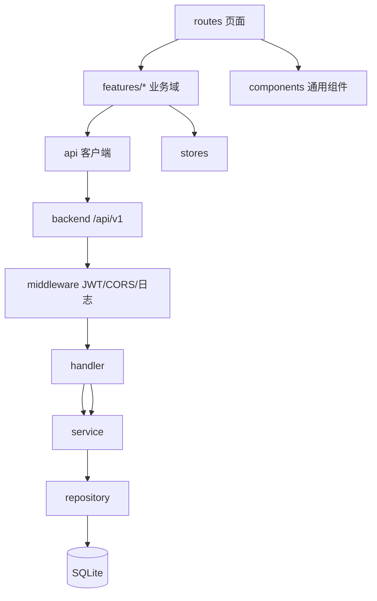

# 代码地图

> `backend/`（含 `seed/`）已创建；`frontend/` 已落地账号页与科目选择/章节练习/随机练习（`routes`/`features/auth`/`features/practice`/`components`/`api`/`stores`），真题模拟为路由占位页，其余目录随后续阶段落地。

## 树

```text
frontend/                 # React SPA（Vite+ 工具链）
  src/
    routes/               # 路由页面：登录/注册、科目选择、章节练习、随机练习、真题模拟、错题本、收藏、统计
    features/             # 按业务域拆分（域内组件/hooks/类型就近放）
      auth/               # 注册/登录、token 管理
      practice/           # 顺序/随机刷题、逐题判分
      exam/               # 整卷模拟：计时、答题卡、交卷评分
      mistakes/           # 错题本与重刷
      favorites/          # 收藏
      stats/              # 刷题统计
    components/           # 跨域通用组件：题目卡片、选项组、答题卡…
    api/                  # 后端 REST 调用封装（唯一 fetch 出口）
    stores/               # zustand 客户端状态
    hooks/ lib/ types/    # 通用 hooks、工具、共享类型
backend/                  # Go REST API（Gin + GORM + SQLite）
  cmd/server/             # main 入口：装配 DB、路由、中间件
  internal/
    handler/              # Gin 处理器：参数校验、响应
    service/              # 业务：判分、错题、收藏、统计、JWT
    repository/           # GORM 数据访问
    model/                # 表模型：user/subject/question/paper/answer_record/mistake/favorite…
    middleware/           # JWT 鉴权、CORS、slog 日志
  seed/                   # 题库种子数据（JSON）与幂等导入
```

## 模块

| 模块 | 路径 | 职责 | 主要入口 |
| --- | --- | --- | --- |
| 前端应用 | `frontend/src/routes` | 页面与路由 | `AppRoutes.tsx` |
| 业务域组件 | `frontend/src/features/*` | 各业务域 UI 与交互 | 域内 index |
| API 客户端 | `frontend/src/api` | 封装全部后端调用 | `client.ts` |
| API 服务 | `backend/cmd/server` | 进程入口、路由装配 | `main.go` |
| 接口层 | `backend/internal/handler` | REST 端点 | 各 handler 文件 |
| 业务层 | `backend/internal/service` | 判分/错题/统计/JWT | 各 service 文件 |
| 数据层 | `backend/internal/repository` | GORM CRUD | 各 repository 文件 |
| 题库种子 | `backend/seed` | 题库 JSON 与幂等导入 | `Import`（启动时由 `cmd/server` 调用） |

## 依赖



## 关键路径

- 启动：`backend/cmd/server` 打开 SQLite → AutoMigrate → 幂等种子导入 → 注册中间件与路由 → 监听；前端 `vp dev` 起 Vite 开发服务器并代理 `/api` 到后端
- 答题请求：routes → features → api →（HTTP `/api/v1`）→ middleware(JWT) → handler → service(判分/沉淀错题) → repository → SQLite
